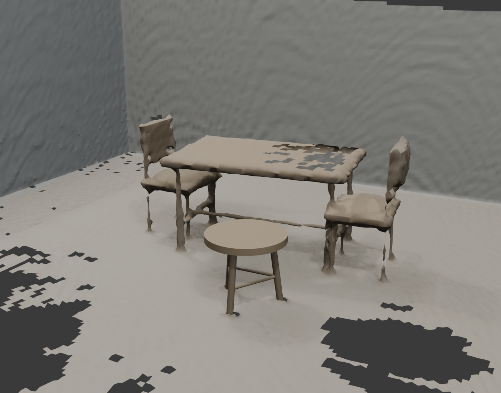
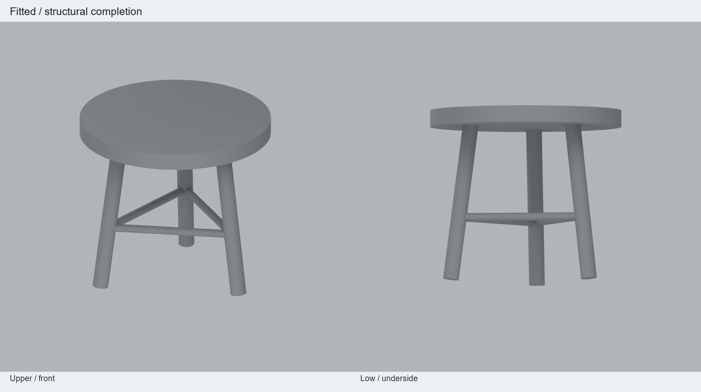
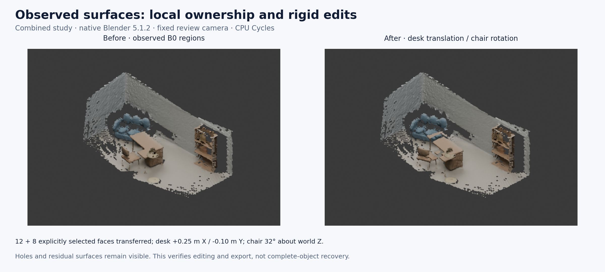
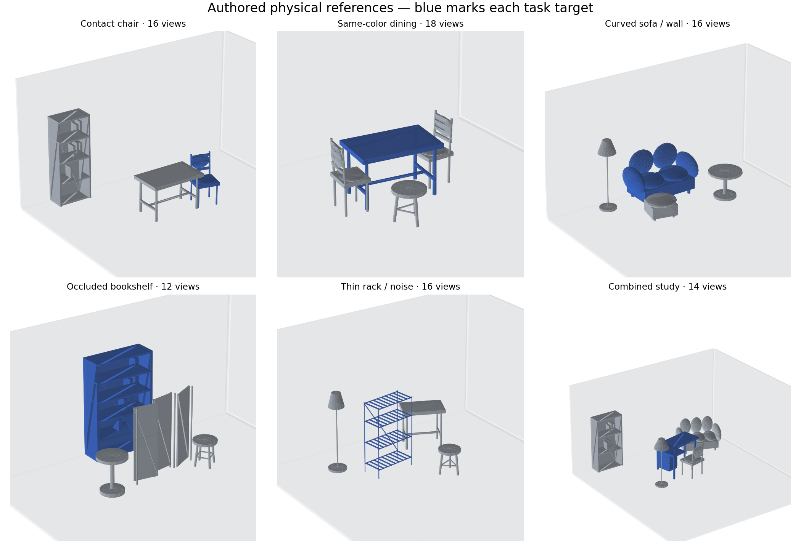
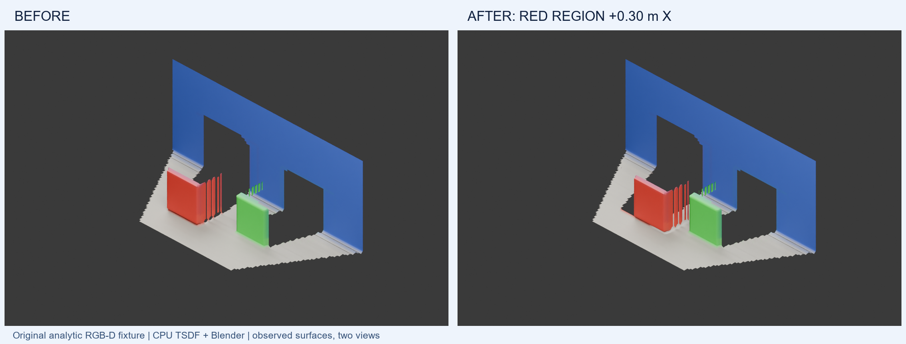
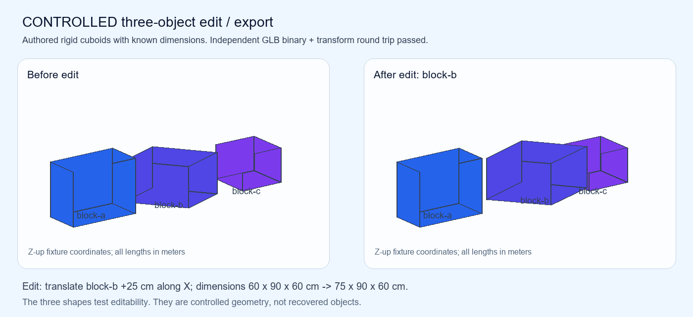

<p align="center">
  
  <br>
  <sub>SPATIAL SCENE EXPERIMENTS</sub>
</p>

# SpatialSceneLab

Local RGB-D experiments for traceable measured surfaces, object-region editing
and native Blender/GLB export validation. The current CPU workflow reconstructs
a prepared scanner capture on Windows, keeps meter units and object UUIDs,
edits selected observations and fused surface regions, and checks their world
geometry after saving and reopening.

**Scene integration and transfer, 2026-10-09:** the completed stool now sits in
the original dining scene with seven editable parts and a retained observed
comparison layer. Six new synthetic development cases expose and fix an
acceptance defect: an elliptical-seat candidate passed the old mean-error gate
but fails the new validation-tail check. The two compatible cases and one
limited-view/noise case remain accepted, with independent triangle P95 of
**3.012 / 3.135 / 7.182 mm**. All 40 candidate PLY files are identical between
the original and revised decisions. Nine original scene objects are preserved;
the 12-mesh GLB round trip has maximum corner error **1.1773 µm**.

[Open the editable dining scene](examples/stool-scene/repaired-dining.blend) ·
[GLB](examples/stool-scene/repaired-dining.glb) ·
[Use and reproduce / 使用与复现](examples/stool-scene/README.md) ·
[English transfer report](reports/STOOL-TRANSFER-2026-10-09.md) ·
[中文迁移与场景报告](reports/STOOL-TRANSFER-2026-10-09.zh-CN.md)



**Real-object follow-up, 2026-10-09:** the existing tea-room table exposes a
cross-view consistency problem. On the same 7,127 later-frame observations, a
fixed training plane has 15.489 mm mean / 26.409 mm P95 residual. Background-only
ICP reduces the mean to 11.787 mm but worsens P95 to 35.510 mm; only 58.117%
fall within 10 mm, below the declared 80% support target. The CPU replay retains
failed registrations and every original validation observation. This is a
reproducible failure analysis; a real editable tabletop remains to be delivered.

[English real-table report](reports/REAL-TABLETOP-2026-10-09.md) ·
[中文真实桌面报告](reports/REAL-TABLETOP-2026-10-09.zh-CN.md) ·
[Replay code](audit_real_tabletop.py) ·
[Measured comparison](reports/real-tabletop/comparison.json)

**Geometry quality, 2026-10-09:** a broken dining stool now has an observation-fitted
editable assembly: one seat, three legs and three braces. All nine intended joints
have solid contact. Independent distance to the exported triangles is **1.047 mm
mean / 2.954 mm P95** on 1,885 odd-frame validation points. The native Blender
file reopens with all seven parts and its GLB round trip has zero measured error.
This is one synthetic development case with an explicitly selected furniture
family; it establishes a usable bounded asset, not general furniture recovery.

[Download Blender](examples/stool-fit/native/editable-stool.blend) ·
[Download GLB](examples/stool-fit/native/editable-stool.glb) ·
[Reproduce / 使用与复现](examples/stool-fit/README.md) ·
[English report](reports/STOOL-QUALITY-2026-10-09.md) ·
[中文实测报告](reports/STOOL-QUALITY-2026-10-09.zh-CN.md)



The input observations and independent evaluation reference are included. Fitting
reads only the observations and existing box/floor priors. Structural assumptions,
train/validation split, all fitted parts and counterexamples are inspectable.

**S2a measured 2026-10-08:** B1 omissions now have per-face decision traces.
Dining misses are dominated by competing boxes (99.46% of missed scorable area);
shelf misses by observed surface outside its target box (99.19%). All six B1
partitions passed native editing and independent source-lineage checks across
491,066 faces. These diagnostics preserve the original scores.

[English S2a report](reports/OWNERSHIP-S2A-2026-10-08.md) ·
[中文 S2a 报告](reports/OWNERSHIP-S2A-2026-10-08.zh-CN.md) ·
[Reproduce / edit](docs/OWNERSHIP-S2A.md) · [中文操作](docs/OWNERSHIP-S2A.zh-CN.md) ·
[Download the initial B1 dining task](examples/ownership-b1/dining-b1-author-task.zip).

Actual author correction and timing remain pending. The download is a starting
scene with unresolved faces, plus the standalone Blender panel and source maps.
The [bounded author task and score command](docs/OWNERSHIP-S2A.md#first-bounded-correction-and-scoring)
connect the final ownership sidecar back to the original fixed-mesh evaluator.
Successful edit logs do not measure human time or failed attempts; record them
during the task.

**S1 measured 2026-10-06:** all six development scenes completed native Blender
face reassignment, metre translation, pivoted rotation, four undo/redo cycles
and fresh-process save/reopen. Fifteen isolated fault controls passed. The
standalone [Blender panel](blender_edit.py) preserves source-face lineage and
observed colours during explicit reassignment, and exports a hash-bound GLB +
identity record. The native `.blend` remains the editable authority.

[English S1 report](reports/EDITING-S1-2026-10-06.md) ·
[中文 S1 报告](reports/EDITING-S1-2026-10-06.zh-CN.md) ·
[Run / install](docs/EDITING-S1.md) · [中文使用与复现](docs/EDITING-S1.zh-CN.md) ·
[Download the editable study](examples/edit-workflow/combined-study-editable.zip).



These are scripted engineering tasks on incomplete observed B0 regions. Visible
holes and leftover fragments are retained; human correction quality, independent
real-instance accuracy and whole-machine disconnected execution remain to be measured.

**S0 measured 2026-10-04:** six original complex development scenes, 92 RGB-D
views and 18 fixed-mesh B0/B1/B2 comparisons completed locally on CPU. Target
area IoU averaged 0.791204 / 0.823510 / 0.818533; the simple centroid rule is
the strongest current control on these development targets.
[English report](reports/DEVELOPMENT-S0-2026-10-04.md) ·
[中文报告](reports/DEVELOPMENT-S0-2026-10-04.zh-CN.md) ·
[Run it](docs/DEVELOPMENT-S0.md) · [中文复现](docs/DEVELOPMENT-S0.zh-CN.md).



**Earlier baseline, 2026-10-04:** 24 automated tests passed; a real 62-frame `tea_room` scan produced
639,790 sampled observations and a TSDF mesh with 83,425 vertices and 155,768
triangles. Sofa0's selected surface region moved +0.3 m X in Blender 5.1.2.
Both GLB reimports had maximum world-vertex distance 8.94e-7 m; the edited
`.blend` reopened with zero world-vertex error. There are 275 Sofa0 candidate
boundary faces retained in the environment, so complete semantic object
extraction remains unverified. The Python outbound-network guard passed its
recorded checks; whole-machine network isolation remains pending.

[English measured report](reports/LOCAL-SCAN-2026-10-04.md) ·
[中文实测报告](reports/LOCAL-SCAN-2026-10-04.zh-CN.md) ·
[English reproduction guide](docs/REPRODUCING.md) ·
[中文复现说明](docs/REPRODUCING.zh-CN.md) ·
[Machine results](reports/local-scan-results.json) ·
[Input hashes](docs/tea-room-source-manifest.json)

**Next stage:** continue the same real Table0, resolving cross-view agreement
and table/chair boundaries before structural completion. Compare target-aware
local alignment with the frozen background-only control on both the object and
neighbouring geometry. The six synthetic transfer cases establish a bounded
development check; they do not establish general furniture recovery.
Measure actual author correction effort and keep observed geometry distinct
from structural completion. S2a separates competing-box and outside-box
omissions before choosing a method. The
[English evaluation protocol](docs/NEXT-STAGE-PROTOCOL.md) and
[中文评测协议](docs/NEXT-STAGE-PROTOCOL.zh-CN.md) specify independent scenes,
direct baselines, area-based metrics, ablations and claim gates. This protocol
has begun with S0 comparisons, S1 native editing and S2a attribution. The 18 held-out groups,
real-room reference acquisition and full interactive/product acceptance remain pending;
their planned counts are not measured results.

## Run the original public fixture

The MIT fixture independently ray casts two physical boxes, a floor and a back
wall from two cameras. It includes source labels and a physical reference PCD.
Its full reconstruction/Blender chain is public, including
[before GLB](examples/local-scan-fixture/before.glb) and
[after GLB](examples/local-scan-fixture/after.glb).



Use Python 3.12 and Blender 5.1.2. The measured Python environment used 3.12.14,
NumPy 2.3.5, Pillow 12.3.0 and Open3D 0.19.0. Both TSDF fusion and rendering ran
on CPU on the available Windows computer with 64 GB RAM and an RTX 4060 Laptop
8 GB. From this repository root in PowerShell:

```powershell
$Python312 = 'C:\path\to\Python312\python.exe'
& $Python312 -m venv '.local\venv312'
$Python = (Resolve-Path '.local\venv312\Scripts\python.exe').Path
& $Python -m pip install -r requirements-local-lock.txt
$Blender = 'C:\path\to\blender\blender.exe'
& $Python -m unittest discover -s tests -v
& $Python fixtures/make_rgbd_fixture.py --output '.local\fixture-input' --resolution-scale 4
& $Python scan_pipeline.py reconstruct --input '.local\fixture-input' --output '.local\fixture-before' --frame-step 1 --pixel-step 2 --min-confidence 1 --max-depth 6 --voxel-size 0.015 --box-margin 0.025 --structure-tolerance 0.025
& $Python scan_pipeline.py edit --scene '.local\fixture-before\scene.json' --object synthetic-target --translate 0.3 0 0.1 --output '.local\fixture-point-edit'
& $Python reconstruct_mesh.py --scene '.local\fixture-before\scene.json' --output '.local\fixture-surface' --voxel-size 0.035 --truncation 0.105
& $Blender --background --factory-startup --python blender_scene.py -- --scene '.local\fixture-surface\surface-scene.json' --output '.local\fixture-blender' --object synthetic-target --translate 0.3 0 0
```

The environment lock targets Windows x64 / Python 3.12. The example uses a
source Y-up world in meters, converts once to Blender's Z-up world, and exports
native glTF/GLB. At resolution scale 4, the two-frame fixture has 192×128 depth,
384×256 RGB, 12,284 sampled observations, 9,081 surface vertices, 16,820
triangles and three Blender mesh parts. Inspect `scene.json`, the
per-layer PLYs, `surface-scene.json`, `edit-result.json` and
`blender-verification.json` alongside the rendered views. Negative controls
detect units/axis mistakes, invalid sensor values, proxy-only movement and
changes to unrelated objects.

## Reproduce the measured real scan

Follow the [English](docs/REPRODUCING.md) or [中文](docs/REPRODUCING.zh-CN.md)
guide to prepare the fixed `tea_room` input, software archives and wheelhouse,
then reconstruct, edit and verify using local files. The pipeline preserves
depth-pixel/frame provenance, explicit geometric ownership and unresolved
candidates. The GLB check uses native Blender I/O and compares UUIDs, roles,
triangle counts and bidirectional world-vertex distances.

The input is a ScannerApp RGB-D/RoomPlan capture with known camera poses and
calibration. Its pinned source is
[LiteReality/example-scans `3f2ca5d`](https://github.com/LiteReality/example-scans/tree/3f2ca5d618fe86b264716200baea19ae0aea0d49/tea_room).
The pinned data repository has no license file, so original inputs and their
derived meshes, Blender scenes and renders remain local. Public resources carry
source links, file hashes, metrics and the original fixture. See
[artifact terms](THIRD_PARTY_NOTICES.md).

This project demonstrates measured integration of calibrated projection,
Open3D TSDF, scene provenance and Blender/glTF validation. Current limits are
one real scan, geometric object priors, incomplete/occluded surfaces and no
independent physical-dimension ground truth. Numerical consistency and a
same-scanner PCD comparison do not establish real-world accuracy. The reports
identify these limits and the exact scope of the network audit.

## 中文入口与作品证据

当前工程已在本机完成真实 RGB-D 观测、CPU TSDF 表面、选定区域位移与
Blender/GLB 回读。求职展示可据实说明坐标与单位处理、观测来源保持、对象区域
编辑及可复现验证，并通过源码、负对照、机器结果和原创公开 GLB 检查这些能力。
完整语义物体恢复及整机断网验收仍需进一步证据。

[中文实测报告](reports/LOCAL-SCAN-2026-10-04.zh-CN.md)解释具体问题、实现、验证
与边界，[中文复现说明](docs/REPRODUCING.zh-CN.md)给出联网准备、离线资源、
Windows 命令和产物说明。上述公开合成数据与示例均为原创 MIT 资源。

## Stage 1 historical controlled experiment

The 2026-10-02 stage edits three authored rigid cuboids and verifies GLB vertex
buffers, units and transforms. A separate local audit checks retained original
MapAnything/TUM reconstructed points with their cameras. The original reports
preserve the environment and measurements of that stage.



Using Python with NumPy available:

```powershell
python scene_lab.py export fixtures/three-objects.json examples/three-objects-before.glb
python scene_lab.py edit fixtures/three-objects.json examples/three-objects-edited.json --object block-b --translate 25 0 0 --dimensions 75 90 60 --unit cm
python scene_lab.py export examples/three-objects-edited.json examples/three-objects-after.glb
python scene_lab.py verify examples/three-objects-edited.json examples/three-objects-after.glb
```

The edit translates block-b by 0.25 m X and changes its X dimension from 0.60 m
to 0.75 m. The source declares units and a right-handed Z-up frame; GLB is
meters/Y-up with source metadata in `asset.extras`. Negative controls reject a
100× unit relabel and a missing axis conversion. Pillow can rerender this
original figure with `render_evidence.py`.

With the retained GeometryAudit artifact archive matching its documented layout:

```powershell
python scene_lab.py reconstruction --artifact-root 'C:\path\to\geometry-audit' --output '.local\reconstruction-audit'
python scene_lab.py environment '.local\environment.json'
```

This historical command checks original SHA256 values before reading the raw
NPZ/GLB evidence and exports sampled points plus camera transforms. Its
model-predicted scale was not independently validated for object dimensions.

[English Stage 1 report](reports/STAGE-1.md) ·
[中文第一阶段报告](reports/STAGE-1.zh-CN.md) ·
[Stage 1 machine results](reports/stage-1-results.json)

Original source, documentation, fixtures and fixture-derived assets:
[MIT](LICENSE). External material retains its source terms.
