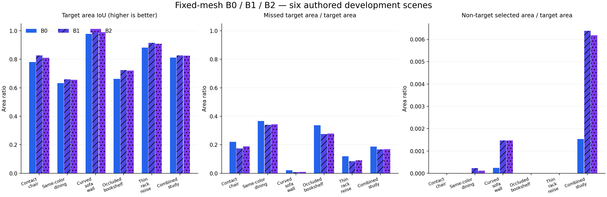

# 六组复杂场景：固定网格分区的开发实测

实测日期：2026-10-04 · S0 开发证据

[English](DEVELOPMENT-S0-2026-10-04.md) · [复现说明](../docs/DEVELOPMENT-S0.zh-CN.md) ·
[JSON](development-s0-results.json) · [CSV](development-s0-metrics.csv)

## 结果与决定

六组独立原创开发布局、92 帧 RGB-D 和 18 项 B0/B1/B2 任务在 CPU 上完成，
共生成 386,001 条采样观测和 491,066 个重建三角面。简单质心规则 B1 在六组
目标上均优于已发布的 B0，B2 的面内面积采样未超过 B1。因此先保留 B1 作为
强简单对照，调查其残留错误，再决定是否增加复杂推断。本轮是开发证据，尚
不能证明保留集优势或新分割算法的贡献。

| 方法 | 场景宏平均目标面积 IoU | 漏选目标面积 / 目标面积 | 误选非目标面积 / 目标面积 | 可评分目标 |
| --- | ---: | ---: | ---: | ---: |
| B0：三顶点一致 | 0.791204 | 20.8548% | 0.029689% | 6 / 6 |
| B1：质心唯一归属 | 0.823510 | 17.5341% | 0.134835% | 6 / 6 |
| B2：面内面积多数 | 0.818533 | 18.0361% | 0.129465% | 6 / 6 |

B1 开发宏平均 IoU 提高 3.2306 个百分点，同时误选非目标面积有所增加。
尚未确定非劣效界限或保留集统计结论，应逐场景检查错误和不可评分面积。

## 输入与独立参考

总览展示原创物理参考，而非完整恢复的重建。这些原创 MIT 几何和生成 RGB-D
与前一报告中缺少许可证、保留本地的真实 tea_room 分别管理。几何包含曲面
多部件家具、腿/杆/书架、接触、盒重叠、同色和遮挡。

| 开发组 | 帧数 | 网格三角面 | 目标 IoU：B0 / B1 / B2 | 可评分网格面积 |
| --- | ---: | ---: | --- | ---: |
| 接触椅子 | 16 | 99,511 | 0.780015 / 0.826313 / 0.810374 | 99.9651% |
| 同色餐厅 | 18 | 96,518 | 0.632621 / 0.659131 / 0.656372 | 99.9469% |
| 曲面沙发与墙 | 16 | 67,055 | 0.978251 / 0.989665 / 0.988877 | 99.9520% |
| 遮挡书架 | 12 | 52,131 | 0.663292 / 0.724015 / 0.721101 | 99.8090% |
| 细杆架与噪声 | 16 | 103,884 | 0.881332 / 0.914942 / 0.908714 | 99.9598% |
| 组合书房 | 14 | 71,967 | 0.811715 / 0.826998 / 0.825758 | 99.8314% |

冻结配置记录几何、种子、盒扰动与传感器压力，参数属于声明的开发压力假设，
不是真实传感器标定。生成器独立对物理几何射线求交，再加入深度噪声/缺失，
测量相机姿态与射线真实姿态分开保存。参考实例标签不来自被测盒；三种分区
都在加载参考标签前完成。

## 固定网格与计分

每组共享同一 TSDF 网格（体素 0.035 m、截断 0.105 m）和归属先验。B0 要求
三顶点一致，B1 使用质心，B2 每面使用 49 个确定性面积样本、最大标签占比
至少 0.6 才接受。参考属于目标的未决预测计漏选。

主评测每重建面用 7 个面积积分样本，以 0.08 m 内最近物理参考表面提供标签；
不同归属最近距离差不超过 0.002 m 时不可评分。IoU=TP/(TP+FP+FN)，两个错误
比例都用可评分目标面积作分母。候选域外目标仍计漏选。指标衡量选择，不是
已执行编辑或完整物体恢复。

可评分比例基于整个重建网格，其中大量是环境，不能证明参考可见表面覆盖或
未观测表面恢复。当前没有法向/可见性过滤，参考含可能隐藏的部件内部表面。
保守界限处理不可评分标签，不覆盖有限积分误差；真实场景物理精度仍未评测。

## 资源、完整性与失败

[敏感性重放](development-s0/sensitivity-results.json)完成 108/108 项，无完整性或
评测错误。18 项原始 0.08 m / 7 样本任务逐对象复核一致。以下六配置的宏平均
IoU 排名均为 B1 > B2 > B0：

| 匹配容差 | 每面面积样本 | B0 | B1 | B2 |
| --- | ---: | ---: | ---: | ---: |
| 0.04 m | 7 | 0.793307 | 0.826493 | 0.821256 |
| 0.08 m | 7 | 0.791204 | 0.823510 | 0.818533 |
| 0.12 m | 7 | 0.791120 | 0.823475 | 0.818498 |
| 0.04 m | 49 | 0.793428 | 0.826495 | 0.821272 |
| 0.08 m | 49 | 0.791219 | 0.823470 | 0.818495 |
| 0.12 m | 49 | 0.791135 | 0.823432 | 0.818457 |

固定场景/方法/容差，7→49 样本最大目标 IoU 变化为 0.000826593（细杆 B0，
0.04 m）。可评分全网格面积为 96.5906–99.9691%。这是开发输入上的积分稳定性
观测，不是误差上界或参考可见覆盖。含 CPython 守卫包装的重放耗时 303.859 秒，
完整配置结果与错误保留在 JSON/CSV。

最终含重建和评测耗时 30.760 秒，单进程生命周期峰值工作集 240,291,840 字节
（229.16 MiB），并非每组增量或全进程树内存。B0 分区耗时 0.016–0.032 秒，
B1 为 0.031–0.052 秒，B2 为 0.810–1.525 秒。这是单次本地测量，不是延迟分布。
Windows 主机有 64 GB RAM / RTX 4060 Laptop 8 GB，实际用 CPU，无 GPU 模型
推理，零新增付费。精确版本与哈希见 JSON。

SHA-256 关联生成器/配置、原始输入、场景、表面清单/网格、参考、面标签与
指标。CPython socket/DNS 拒绝探针通过，运行时未记录被拒绝请求，不能等同
系统隔离。此前两次成功运行保留本地作为补齐最终重放关联前的记录；公开
数值仅用完整关联的最终运行。

额外组合书房 Blender 探针把 B0 桌子区域移动 (0.28, 0, 0.12) m。原生 `.blend`
回读通过，前后 GLB 的环境连接检查均失败，尽管三角面数量不变，最大世界
顶点距离仅 1.284e-6 m。[失败 JSON](development-s0/native-export-failure.json)已保留。
验收前须诊断是导出连接变化还是验证器最近顶点映射歧义；此结果不属于通过
验收的复杂编辑演示。[只读 before 诊断](development-s0/before-diagnostic.json)已将
其失败定位到最近顶点映射不稳定：相距 1.609e-6 m 的源顶点引发全部 5 个面索引
差异，局部三角角坐标多重集合精确相同。after 资产与 seam/焊接语义仍待核查，
原失败结果保持。可用 `blender_scene.py`、组合书房表面、目标 `combined-desk`
和位移 `0.28 0 0.12` 复现。

## 验收与下一步

S0 交付复杂开发输入、独立标签、固定网格对照、面积指标和明确歧义/失败分母。
18 组保留集、真实房间参考、可见性匹配、B3/B4、完整编辑矩阵、人工修正成本
和整机断网仍按[完整协议](../docs/NEXT-STAGE-PROTOCOL.zh-CN.md)待验收。

下一步先诊断 GLB 失败，再完善 Blender 归属检查/修正、平移/旋转、撤销和
回读。用独立标签解释同色餐厅与书架的漏选，最终方法冻结后才打开保留集标签。
论文证据、方法改进和产品任务分别验收。
