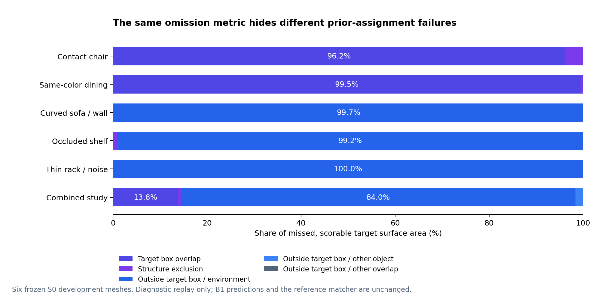

# S2a：解释归属漏选，并把实测 B1 分区接入编辑流程

实测日期：2026-10-08（北京时间）。[English](OWNERSHIP-S2A-2026-10-08.md)。

同一个漏选面积指标，背后有不同的归属机制。在六个冻结的 S0 开发网格中，
**餐厅目标漏选、可评分面积的 99.46% 位于相互竞争的目标盒中**；
**书架目标漏选面积的 99.19% 位于目标盒之外，并被归入环境**。
这是对现有 B1 规则决策路径的归因，预测、参考匹配方式和原分数均未改变。

已经评分的 B1 分区现已接入 Blender 原生编辑流程。六场景导出、脚本编辑和
独立原生来源核对全部通过。[餐厅任务下载](../examples/ownership-b1/dining-b1-author-task.zip)
可直接在 Blender 打开；真实操作者的修正质量与耗时仍待记录。

## 固定输入与方法

锚点为已发布的 [S0 结果](development-s0-results.json)，SHA256：
`5bb302eac773d8a2e0af299e6fe3f476f413740e4ffd5261419332621c7e2071`。
复用六个网格共 491,066 个三角面、输入对象盒/结构先验和 B1 归属数组。
本轮没有重新重建、模型推理或调参。先仅用先验精确重放 B1，之后才引入参考
标签进行诊断。B1 编辑导出全程不读取参考标签。

沿用原评分器：每面七个重心面积采样，最近参考容差 0.08 m，歧义间隔
0.002 m。以每批 1,024 面的临时面编号恢复逐来源面的参考面积。
十一类互斥面积覆盖 TP、五种 FN、两种 FP、TN 和两类不可评分面积。
一个三角面可能跨越多个参考标签，因此保留面积，不以多数标签取代。
结构排除优先于目标盒重叠；目标盒外的情形按最终归属区分，同时保留原始标记。

## 实测结果

下表比例的分母是各目标**漏选且可评分的表面面积**，不是全部目标面积或
完整物理对象。FN 面积单位为平方米。

| 开发目标 | 原 B1 IoU | FN 面积（m²） | 目标盒重叠 | 目标盒外→环境 | 其他 FN 原因 |
|---|---:|---:|---:|---:|---:|
| 接触椅 | 0.826313 | 0.192059 | 96.1728% | 0% | 3.8272% |
| 同色餐厅 | 0.659131 | 0.844693 | 99.4648% | 0% | 0.5352% |
| 曲面沙发/墙 | 0.989665 | 0.034715 | 0% | 99.7265% | 0.2735% |
| 遮挡书架 | 0.724015 | 1.206119 | 0% | 99.1850% | 0.8150% |
| 薄杆架/噪声 | 0.914942 | 0.062575 | 0% | 100% | 0% |
| 综合书房 | 0.826998 | 0.482964 | 13.7913% | 84.0313% | 2.1773% |

全部原混淆面积、不可评分面积和 TP/FP/FN 总量守恒，最大绝对差为
**6.8213e-13 m²**。归因执行耗时 **16.3078 秒**，进程生命周期峰值内存
**228,728,832 字节**。这些是单次资源记录，不构成速度对比。
新增付费和模型调用均为零。

结果支持分开设计后续实验：餐厅处理竞争归属，书架找回不完整对象盒之外
已经观测到的目标表面。尚不能据此认定区域生长、颜色或学习方法一定有效。

## 编辑与来源验收

导出后每个来源面恰好保留一次，序列化 PLY 几何、法向和观测颜色精确保持。
重叠保留为单独的 **Unresolved (-2)** 区域。逐分块面/顶点索引映射回原网格；
按表中场景顺序，未决面数为 1,216 / 3,605 / 0 / 67 / 0 / 877。

未修改的 S1 脚本在 B1 分块上完成 **6/6 任务、24 次提交编辑、24 次撤销/
重做和六次新进程重开**，耗时 **152.5904 秒**。每 0.1 秒采样的 Blender
进程树并发 RSS 最大 **1,244,901,376 字节**。GLB 几何与外观回读检查通过。

另启独立 Blender 进程，将实际初始原生面 ID、归属、有向世界三角角点和
线性 RGBA 与原网格直接比较。六场景通过：最大角点误差 **6.1440e-7 m**，
最大线性 RGBA 差 **2.1944e-7**，各自低于 **1e-6**。此来源核对不使用最近点重匹配。

脚本使用固定的 12/8 面选择，证明数据保持，不证明真实边界修正有效。
餐厅下载包提供**初始** B1 场景：96,518 个面，其中 3,605 个未决面，附独立
侧栏代码、完整 B1 表面包和哈希清单。按[人工任务步骤](../docs/OWNERSHIP-S2A.zh-CN.md)
操作并记录实际行为和耗时。

## 材料、检查与限制

- [诊断 JSON](ownership-s2a/diagnostics-results.json)与[全部对象面积 CSV](ownership-s2a/diagnostics-metrics.csv)。
- [B1 导出检查](ownership-s2a/partition-export-results.json)、[原生编辑](ownership-s2a/edit-suite-results.json)、[独立来源核对](ownership-s2a/native-lineage-results.json)。
- [图表 PDF](ownership-s2a/ownership-failure-causes.pdf)、[图表来源](ownership-s2a/figure-manifest.json)、[材料清单](ownership-s2a/manifest.json)。
- [中文复现命令](../docs/OWNERSHIP-S2A.zh-CN.md)与[英文说明](../docs/OWNERSHIP-S2A.md)。逐面 NPZ 可由公开诊断命令再生成，实测哈希在 JSON 中；公开摘要没有重复收录约 30 MB 的本机原始轨迹。
- 原完整 CPU 套件 119 项测试通过，新增公开材料检查核对发布文件和 ZIP 内字节。可移植 CI 不执行 Blender；上面的原生结果在本机 Blender 5.1.2 测得。

实测环境：Windows 11、Python 3.12.14、NumPy 2.3.5、Open3D 0.19.0、
Blender 5.1.2，CPU。图表在另一已有环境以 Matplotlib 3.10.0、NumPy 2.1.3
生成；该环境默认线程 MKL 首次遇到 Windows DLL 加载失败，为绘图进程设置
`MKL_THREADING_LAYER=SEQUENTIAL` 后成功。此前数值诊断已经在独立 CPU 环境完成。

最近参考匹配仍没有法向/可见性过滤，未重建表面不计入分区误差分母。
六组原创开发场景不等于真实独立样本或保留集。真实选面质量、人工修正量、
整机断网和计划中的保留集实验仍未测量。本结果提供具体后续问题和可用任务起点，
不宣称新重建算法。
