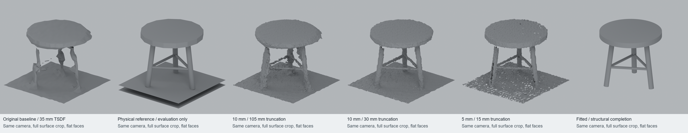

# 从破碎观测到可编辑圆凳

实测日期：2026-10-09 · [English](STOOL-QUALITY-2026-10-09.md) ·
[下载与复现](../examples/stool-fit/README.md)

此前餐厅结果保留了可编辑的来源面，但凳子仍然明显破碎。本轮基于同一批观测
生成完整的七部件圆凳，记录结构假设，并把几何质量与文件／导出保持分别核验。
这是一例原创合成开发场景，不是独立真实场景重建基准。

## 已观察失败与重建对照

MIT 原创 `dev-same-color-dining` 场景包含 18 帧 160 × 120 RGB-D 输入，
2 mm 高斯深度噪声、1.5% 像素丢失，没有位姿扰动。圆凳由圆座面、三条外张腿和
三根横撑组成。原 TSDF 使用 35 mm 体素、105 mm 截断带，而腿和横撑直径分别为
48 mm、24 mm。原 B1 交付凳子有 13 个断片。归属 IoU 0.990428 的分母只包括
已经重建的面，因此不能证明缺失表面的完整性。

测量前固定三组同输入对照，其帧输入哈希一致。重建读取传感器数据与先验，不读
物理参考几何。10/30 mm 设置明显改善细构件，但各 TSDF 版本仍有腿与座面之间
的缺口。5/15 mm 出现更多小孔和分裂，仍没有形成完整可编辑装配。

| 体素／截断，mm | 参考射线召回 ≤5 mm | ≤10 mm | ≤20 mm | B0 凳子面积采样准确率 ≤5 mm | CPU 重建秒数 |
|---|---:|---:|---:|---:|---:|
| 35 / 105，原始 | 72.567% | 87.788% | 96.796% | 56.151% | 原始运行 |
| 10 / 105 | 84.883% | 96.151% | 99.928% | 52.610% | 14.70 |
| 10 / 30 | 98.235% | 99.961% | 99.993% | 95.161% | 11.11 |
| 5 / 15 | 99.349% | 99.935% | 99.987% | 97.586% | 36.01 |

召回分母为全部 **15,354 个有效参考射线命中**，保留不同视角的重复命中，计算到
完整 TSDF 的无符号距离。这是观测加权覆盖，不是可见表面面积或全部表面完整率。
完整表面的近邻可能落在附近非凳子几何上；JSON 同时保留分配给凳子区域的指标。
座面占 12,382 条射线（80.643%），腿 2,094 条，横撑 878 条。10/30 对照下，
5 mm 腿召回由 32.044% 提高至 98.042%，横撑由 13.667% 提高至 93.508%。
准确率在每个 B0 凳子区域进行固定种子的 100,000 次均匀面积采样，与物理参考
比较；它不是 B1 编辑任务的分区评分。

## 受观测约束的结构拟合

操作者明确选择结构族：水平圆座面、三条直线外张圆柱腿、三根水平圆柱横撑。
拟合器只读取打包的 `scene.json` 包围盒／地面先验，以及 `observations.npz`
中的坐标、颜色、初始归属和帧号。参考几何仅供评价，没有将参考顶点或场景生成
参数复制为输出。

先验区域包含 3,812 个点：偶数帧 1,927 点用于训练 26 个参数，奇数帧 1,885 点
用于验证。SciPy 有界最小二乘使用 soft-L1 鲁棒损失、帧／高度分层均衡与三个
初值。选中运行调用目标函数 11 次，没有参数触及边界。最终公开 CLI 在本机
重放耗时 1.32 秒；这是一次墙钟记录，不是重复性能基准。奇数帧参与验收门槛，
必须称为**验证集**，不能称为未经触碰的测试集。结构族选择本身也使用了人的知识。

输出共有 1,134 顶点、2,240 三角面，分成七个独立可编辑的闭合壳体。腿端延伸
进入座面，横撑进入腿，形成实体接触。它们是重叠装配件，不是焊接后的单一实体。
在相同先验下改变观测点会改变拟合位置；两腿支持不足的负例会被拒绝。这些检查
尚不能证明对全部不兼容家具结构都能可靠拒绝。

## 独立几何与原生资产核验

独立评价器查询实际输出三角面距离。以下数值取代拟合器的隐式圆柱残差；在重叠
内部，两种距离定义并不相同。

| 测量项 | 结果 |
|---|---:|
| 奇数帧原始观测点 | 1,885 |
| 奇数帧到三角面平均／P95／最大距离 | 1.047 / 2.954 / 6.294 mm |
| 奇数帧点在 5 / 10 mm 内的比例 | 99.523% / 100% |
| 同一参考射线召回，5 / 10 / 20 mm | 100% / 100% / 100% |
| 参考射线平均／P95／最大距离 | 0.327 / 1.839 / 4.011 mm |
| 七个参考部件等权平均距离 | 0.442 mm |
| 反向面积采样准确率，5 / 10 / 20 mm | 98.492% / 98.737% / 99.223% |
| 反向距离 P95／最大值 | 1.937 / 25.000 mm |
| 闭合部件／边界边 | 7 / 0 |
| 具有正实体重叠的预期连接 | 9 / 9 |
| GLB 往返最大三角形顶点误差 | 0.0 m |

超过 5 mm 的 1,508 个反向样本全部位于拟合座面内部，对应凳腿为形成接触而向内
延伸的位置，仍计入准确率分母。参考本身也由重叠壳体组成，所以反向准确率衡量
到原创壳体的接近程度，不是布尔实体外表面的准确率。已观测射线召回 100% 与
连接成立都不能证明未观测几何必然真实。

接触通过实际凸面半空间独立核验：九个连接端点均有 23.52–24.53 mm 正内部
余量。三个脚的实际最低顶点距地面仅 0.000572–0.001173 mm，处于数值容差内。
Blender 5.1.2 中，七个命名网格位于同一父节点下，使用米制、Z 向上；GLB 使用
米制、Y 向上。独立新进程重开后核验原生网格字节、索引、父子关系、来源哈希，
并对 GLB 重导入进行保留绕序的三角形几何比较。

## 复现材料与限制

拟合使用本机已有 Windows CPU 环境 NumPy 2.1.3、SciPy 1.15.3；TSDF 与评价使用
Python 3.12.14、NumPy 2.3.5、Open3D 0.19.0；资产构建与渲染使用 Blender 5.1.2。
没有购买模型／API 或使用 GPU 推理。拟合环境与固定 RGB-D 环境分开，命令见
[使用与复现指南](../examples/stool-fit/README.md)。

- [TSDF 原始指标](stool-quality/tsdf-metrics.json)与[运行耗时](stool-quality/reconstruction-runs.json)。
- [拟合几何独立指标](stool-quality/fit-metrics.json)。
- [参数、假设、输入哈希](../examples/stool-fit/fitted/fit.json)。
- [独立进程原生核验](../examples/stool-fit/native/native-verification.json)。
- [图像来源、相机及裁切参数](stool-quality/render-record.json)。
- [拟合器](../fit_stool.py)、[几何评价器](../evaluate_stool_fit.py)、
  [Blender 构建器](../blender_stool.py)、[失败控制](../tests/test_stool_fit.py)。

源码、打包输入、输出资产与评价参考均沿用仓库 MIT 许可。实测 JSON 中的绝对路径
标识原始本地运行；重放工具按显式输入和内容哈希查找文件。本地完整回归发现
146 项测试，144 项通过，Open3D 环境中两项 SciPy 拟合控制明确跳过；随后在
独立 SciPy 环境运行全部 12 项拟合测试，包含这两项控制，全部通过。公开拟合在
Python 出站 socket／DNS 阻断下成功重跑。这一进程级限制小于整机网络隔离范围，
整机断网验收仍待完成。公开正视图渲染脚本在同一 Blender 构建上逐像素复现原图。

这次完成了一例有明确边界的圆凳资产。桌椅、任意拓扑恢复、真实扫描泛化、人工
编辑时间和适合物理求解的焊接实体仍待验证。下一步先验证改变形状的圆凳和不兼容
结构负例，再进入真实观测对象。历史 S0/S1/S2a 保持冻结，不被本轮数值替换。
